# 🛍️ MagikAccessory

A PHP-based online accessories store developed using PHP, MySQL, HTML, CSS, and JavaScript.

## ✨ Features

- 🛍️ Browse available accessories
- 🔍 Search for products
- ↕️ Sort products
- 📄 View product information
- 🛒 Add products to the shopping cart
- 🔐 User login and registration
- 📦 Order processing
- 💳 Payment page
- ⚙️ Admin product management
- 📋 Admin order management

## 🛠️ Technologies

- PHP
- MySQL
- HTML5
- CSS3
- JavaScript

## 🗄️ Database

The project uses **MySQL** as its database.

The database SQL file is included in the repository:

`shop_acessory.sql`

## 📸 Screenshots

### 🏠 Home Page

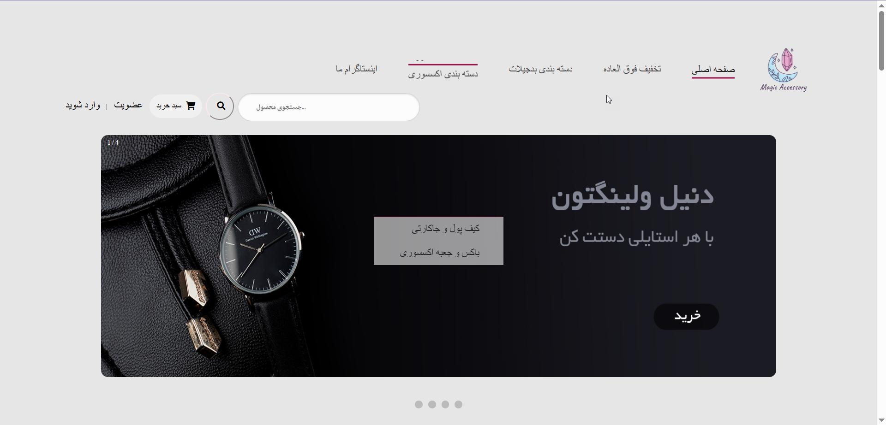

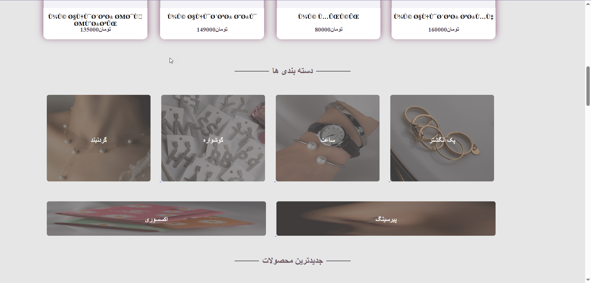

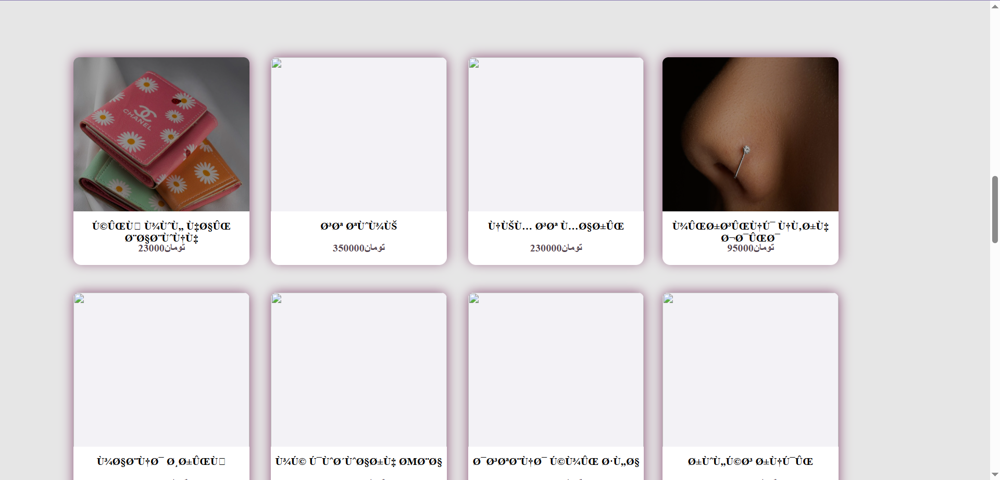

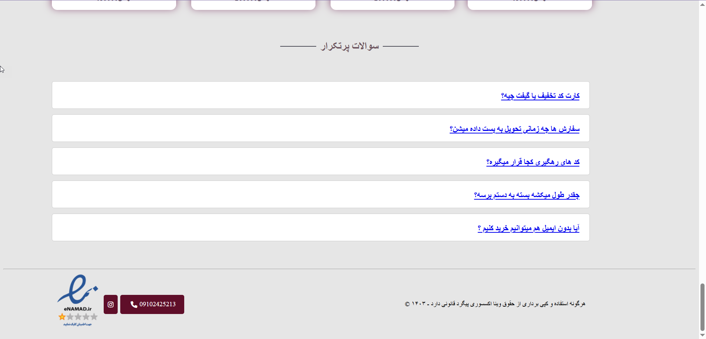

### 🛍️ Products

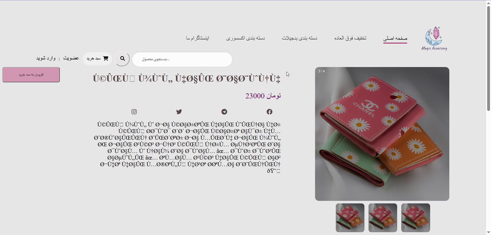

### 🛒 Shopping Cart

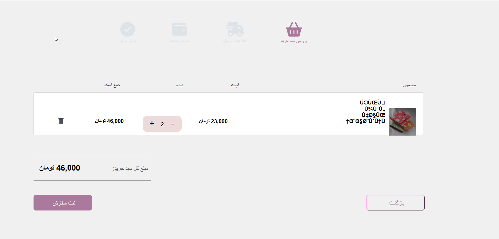

### 🔐 Login

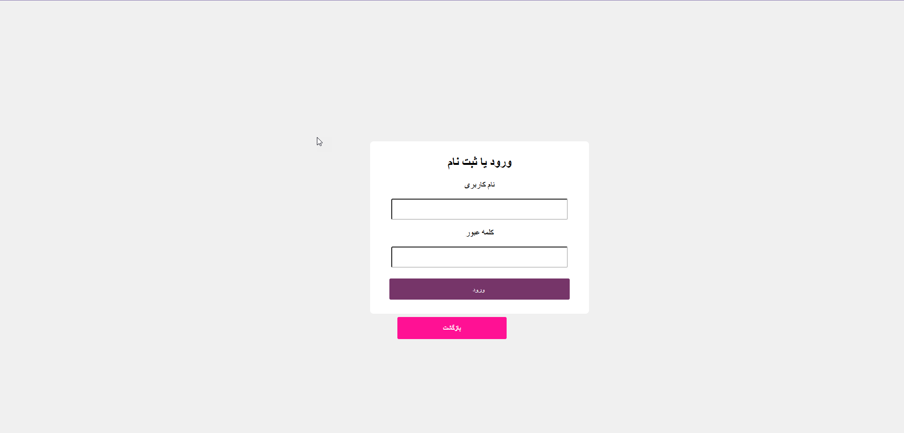

### 📦 Order

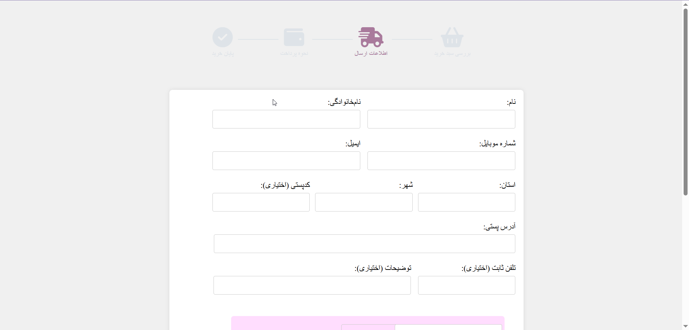

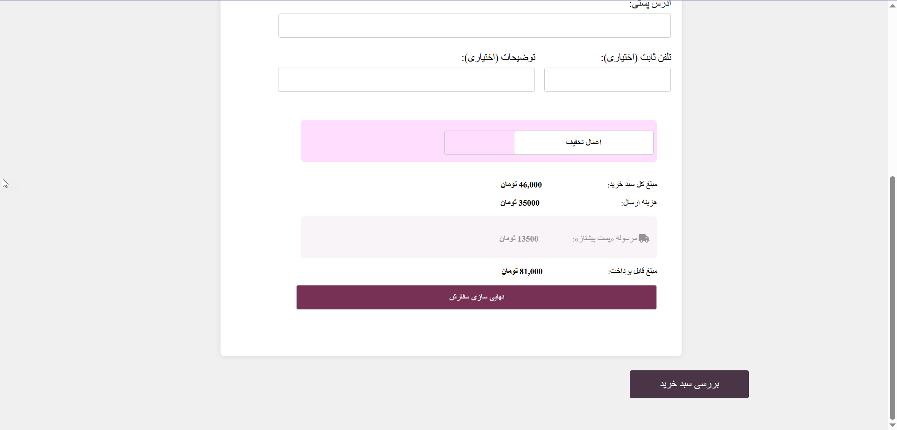

### ⚙️ Admin Panel


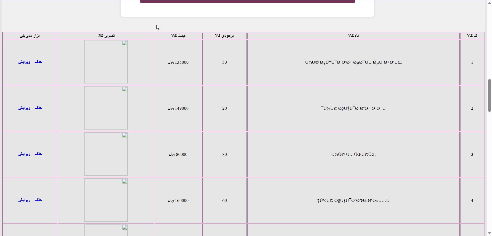

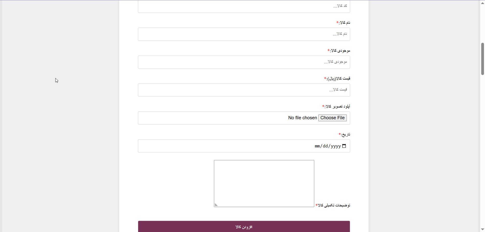

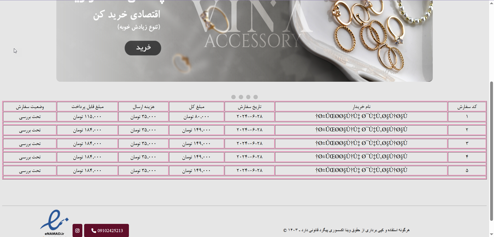

## 🚀 How to Run

1. Install and run **WAMP**.
2. Place the project inside the WAMP `www` directory.
3. Create a MySQL database.
4. Import `shop_acessory.sql` into the database.
5. Configure the database connection in the PHP files if necessary.
6. Open the project in your browser through the local server.

## 📁 Project Structure

```text
MagikAccessory/
│
├── image/                  # Website and product images
├── includes/               # Header and footer files
├── screenshots/            # Project screenshots
│
├── index.php               # Home page
├── product.php             # Product page
├── basket.php              # Shopping basket
├── view_cart.php           # Cart view
├── login.php               # Login page
├── signup.php              # Registration page
├── pay.php                 # Payment page
│
├── admin_products.php      # Admin product management
├── admin_orders_manage.php # Admin order management
│
├── action_*.php            # Form/action handlers
├── process_order.php       # Order processing
├── update_basket.php       # Cart update
├── sort.php                # Product sorting
├── action_search.php       # Product search
│
├── style.css               # Website styles
└── shop_acessory.sql       # Database
